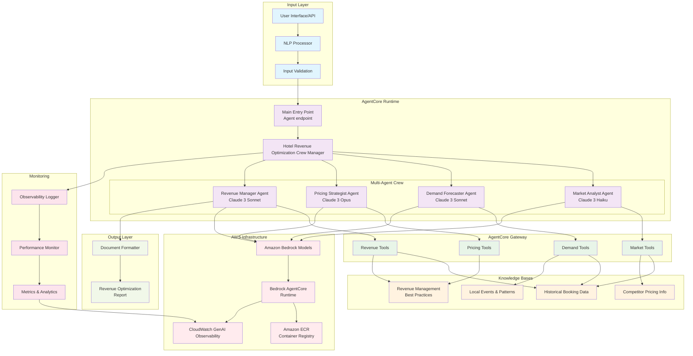
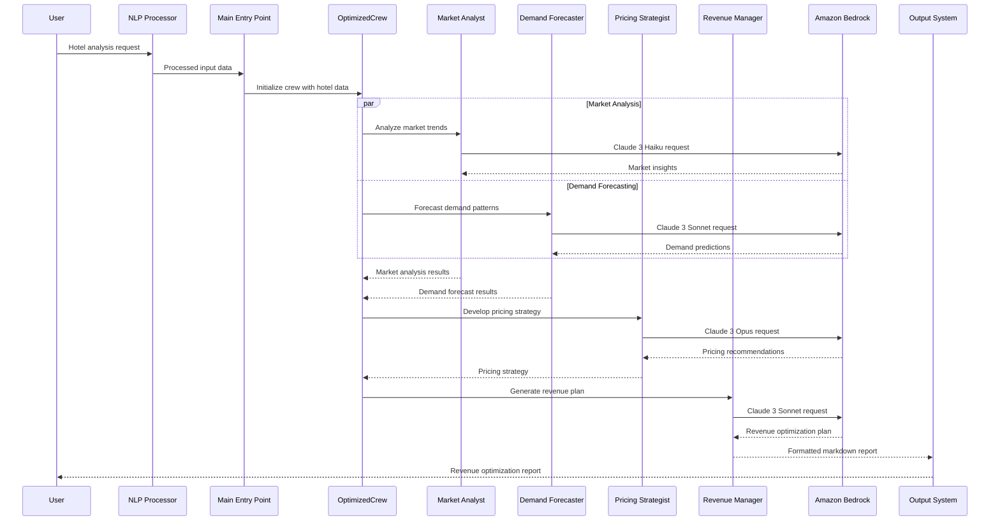
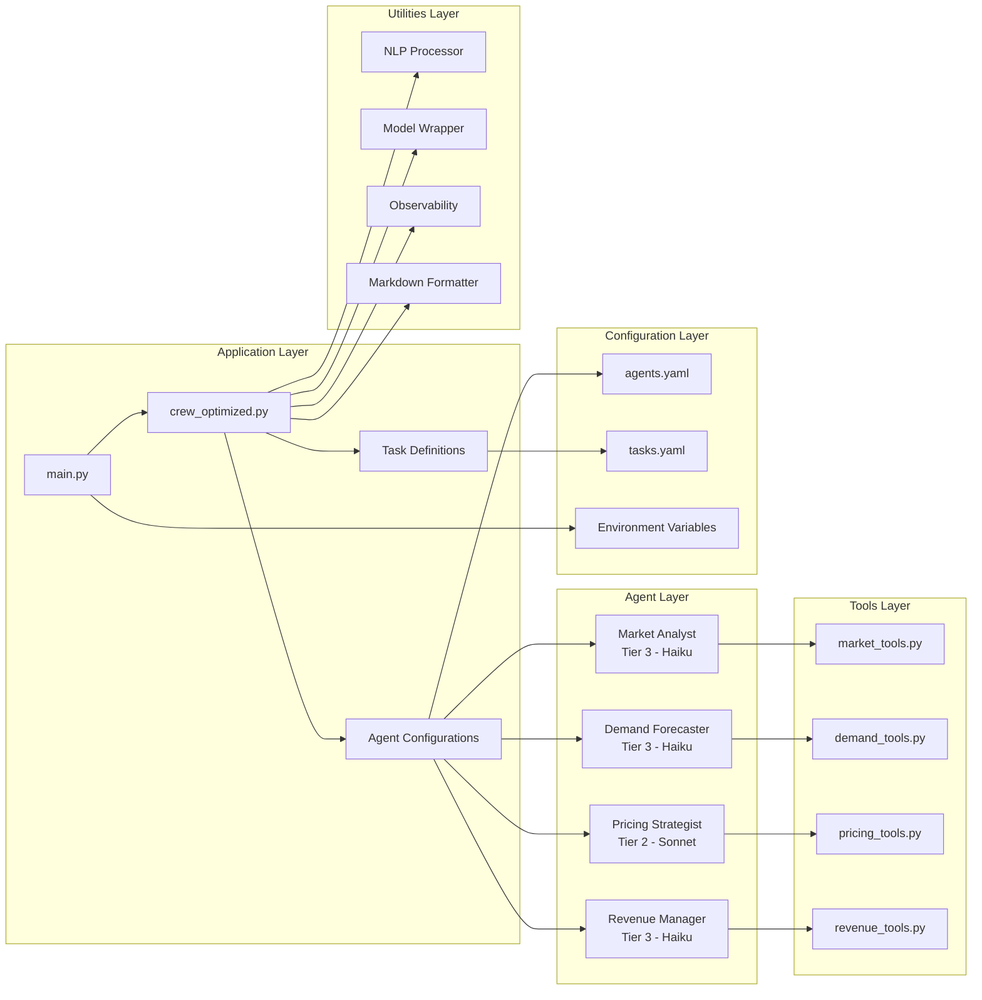
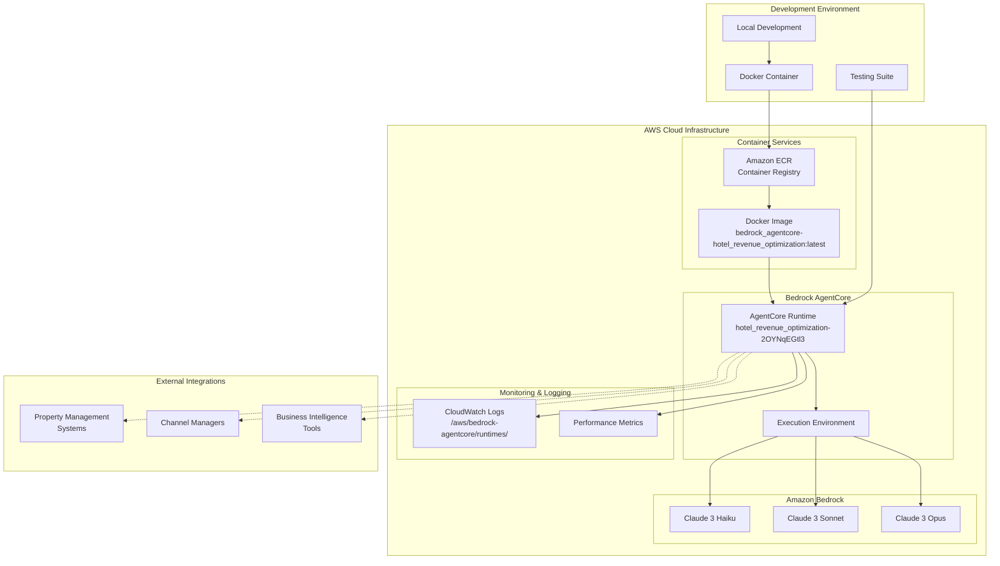

# Hotel Revenue Optimization System

## Project Overview

The Hotel Revenue Optimization System is a multi-agent AI solution that leverages CrewAI and Amazon Bedrock AgentCore to optimize hotel room pricing and maximize revenue. By analyzing market trends, competitor pricing, demand patterns, and historical data, the system provides actionable pricing recommendations and revenue forecasts.

| Information         | Details                                                                      |
|---------------------|------------------------------------------------------------------------------|
| Agent type          | Synchronous                                                                 |
| Agentic Framework   | CrewAI                                                                      |
| LLM models          | Amazon Nova (Premier, Pro, Lite, Micro), Anthropic Claude (3.7 Sonnet, 3.5 Haiku, 3 Haiku) |
| Components          | AgentCore Runtime, Multi-agent collaboration                                |
| Example complexity  | Medium-High                                                                 |
| SDK used            | Amazon BedrockAgentCore Python SDK                                          |
| **Version**         | **2.1.0 - Production Ready** ✅                                             |
| **Status**          | **Deployed & Operational**                                                  |

> 📋 **See [CHANGELOG.md](CHANGELOG.md) for detailed release notes and recent improvements**

## Key Capabilities
- ✅ **Hotel-specific analysis** with dynamic input processing
- ✅ **Natural language processing** (multiple input formats)
- ✅ **Intelligent error handling** (booking/weather/irrelevant queries)
- ✅ **Multi-format input support** (prompt, message, structured JSON)
- ✅ **Provider-based model architecture** (Amazon Nova, Anthropic Claude, Hybrid)
- ✅ **Production deployment** (AWS Bedrock AgentCore)

## Business Value

- **Revenue Increase**: Typically delivers 5-15% RevPAR (Revenue Per Available Room) improvement
- **Operational Efficiency**: Reduces manual pricing analysis by 80%
- **Strategic Advantage**: Enables rapid response to market changes and competitor moves
- **Data-Driven Decisions**: Replaces gut-feel pricing with algorithmic optimization
- **Forecast Accuracy**: Improves occupancy and revenue forecasting by 30-40%

## System Architecture

### Logical Architecture Diagram



### Data Flow Architecture



### Component Architecture



### Deployment Architecture



### Agent Roles

1. **Market Analyst Agent** (Claude 3 Haiku)
   - Monitors market trends and competitor pricing
   - Identifies demand patterns and market opportunities
   - Analyzes external factors affecting demand (events, seasonality, etc.)

2. **Demand Forecaster Agent** (Claude 3 Sonnet)
   - Predicts future demand based on historical data
   - Identifies booking pace and patterns
   - Forecasts occupancy rates for different segments and room types

3. **Pricing Strategist Agent** (Claude 3 Opus)
   - Develops optimal pricing strategies based on market and demand insights
   - Recommends rate adjustments for different channels and segments
   - Identifies upselling and cross-selling opportunities

4. **Revenue Manager Agent** (Claude 3 Sonnet)
   - Implements and monitors pricing changes
   - Evaluates performance against KPIs
   - Provides executive summaries and actionable recommendations

### Knowledge Bases

1. **Historical Booking Data** (Shared)
   - Past reservations with detailed attributes
   - Historical pricing and occupancy rates
   - Cancellation patterns and no-show rates

2. **Competitor Pricing Information** (Market Analyst Agent)
   - Current and historical competitor rates
   - Rate parity analysis across channels
   - Competitor promotional activities

3. **Local Events and Seasonal Patterns** (Demand Forecaster Agent)
   - Calendar of local events and festivals
   - Historical impact of events on demand
   - Seasonal trends and patterns

4. **Revenue Management Best Practices** (Pricing Strategist Agent)
   - Industry benchmarks and KPIs
   - Pricing strategy templates
   - Channel optimization guidelines

## Recent Improvements and Production Readiness

### Version 2.1 - Provider-Based Model Architecture (Latest)

The Hotel Revenue Optimization System now features a clean provider-based architecture with comprehensive model support and performance optimization:

#### Provider-Based Model Architecture
- **Clean Provider Switching**: Single environment variable (`MODEL_PROVIDER`) controls all models
- **Three Provider Options**: AMAZON (default), ANTHROPIC, HYBRID
- **Business Logic Separation**: Agent tiers remain consistent across providers
- **Production Optimized**: Amazon Nova models as default for best speed/cost balance

#### Latest Model Support
- **Amazon Nova Models**: Premier, Pro, Lite, Micro (with inference profiles)
- **Anthropic Claude Models**: 3.7 Sonnet (with prompt caching), 3.5 Haiku, 3 Haiku
- **Hybrid Configuration**: Claude 3.7 for complex reasoning + Nova for speed
- **Automatic Fallbacks**: Intelligent model fallback within provider tiers

#### Performance Benchmarks (AWS Environment)
- **HYBRID Provider**: 46.2 seconds (fastest - balanced performance)
- **ANTHROPIC Provider**: 50.8 seconds (highest quality analysis)
- **AMAZON Provider**: 51.8 seconds (cost-effective)

#### Production Deployment Status
✅ **Successfully deployed to AWS Bedrock AgentCore**
- **Status**: Production-ready with provider-based architecture

### Enhanced Observability
- ✅ Task completion tracking with proper metadata
- ✅ Performance metrics (execution time, task durations)
- ✅ Clean response format (removed empty results)
- ✅ DEBUG-level task output logging

## Prerequisites

* Python >=3.10 <3.14
* AWS CLI configured with appropriate permissions
* Amazon Bedrock access with Claude models enabled
* Docker (for containerized deployment)

## Quick Start Guide

### 1. Set up the environment

Clone the repository and navigate to the project directory:

```bash
git clone <repository-url>
cd hotel_revenue_optimization
```

### 2. Install AgentCore CLI

Download and install the AgentCore CLI:

```bash
# Download AgentCore CLI (replace with actual download URL)
curl -o agentcore https://agentcore-cli-download-url
chmod +x agentcore
sudo mv agentcore /usr/local/bin/
```

### 3. Install dependencies

```bash
pip install -e .
```

### 4. Configure AgentCore

Configure the agent with AgentCore CLI:

```bash
# Configure the agent
agentcore configure \
  --entrypoint src/hotel_revenue_optimization/main.py \
  --name hotel_revenue_optimization \
  --execution-role BedrockAgentCoreRole
```

### 6. Configure environment variables

Create a `.env` file in the root directory with the following variables:

```bash
# =============================================================================
# Hotel Revenue Optimization - Model Configuration
# =============================================================================

# Model Provider Selection (AMAZON, ANTHROPIC, or HYBRID)
MODEL_PROVIDER=AMAZON

# Agent Task Complexity Tiers
MARKET_ANALYST_LLM_TIER=tier2      # Market analysis requires balanced capability
DEMAND_FORECASTER_LLM_TIER=tier2   # Demand forecasting needs good reasoning
PRICING_STRATEGIST_LLM_TIER=tier1  # Pricing strategy is most complex task
REVENUE_MANAGER_LLM_TIER=tier2     # Revenue synthesis requires medium complexity

# AWS Configuration
AWS_REGION=us-west-2

# Logging and Performance
LOG_LEVEL=INFO
ENABLE_PERFORMANCE_LOGGING=true
```

#### Provider Switching Examples:
```bash
# Use Amazon Nova models (default - fastest)
MODEL_PROVIDER=AMAZON

# Use Anthropic Claude models (highest quality)
MODEL_PROVIDER=ANTHROPIC

# Use hybrid approach (balanced performance)
MODEL_PROVIDER=HYBRID
```

## Input Processing and Natural Language Support

### Enhanced Input Handling (v2.0)

The Hotel Revenue Optimization System has been significantly enhanced with robust input processing capabilities that support multiple input formats and intelligent query handling.

#### Supported Input Formats

The system now accepts inputs in multiple formats to accommodate different UI implementations:

1. **Structured JSON Format** (recommended for programmatic access):
   ```json
   {
     "hotel_name": "The Ritz-Carlton",
     "hotel_location": "San Francisco, CA",
     "current_adr": "$450",
     "historical_occupancy": "68%",
     "target_revpar": "15% increase"
   }
   ```

2. **Prompt-based Format** (for chat interfaces):
   ```json
   {
     "prompt": "Analyze revenue optimization for The Ritz-Carlton in San Francisco. Current ADR is $450, occupancy at 68%, targeting 15% RevPAR increase."
   }
   ```

3. **Message-based Format** (for messaging platforms):
   ```json
   {
     "message": "Help me optimize revenue for my boutique hotel in Miami. We have 120 rooms, current ADR $280, occupancy 65%."
   }
   ```

#### Natural Language Processing

The system includes advanced NLP capabilities that can extract hotel information from free-form text:

- **Hotel Name Extraction**: Identifies hotel names from natural language descriptions
- **Location Detection**: Extracts city, state, and geographic information
- **Metric Parsing**: Understands ADR, occupancy rates, RevPAR targets in various formats
- **Context Understanding**: Interprets business challenges and optimization goals

#### Intelligent Error Handling

The system provides intelligent responses for different types of queries:

1. **Irrelevant Queries**: Detects and handles non-hotel-related requests
   ```json
   {
     "error": "irrelevant_query",
     "message": "I specialize in hotel revenue optimization. I can help with pricing strategies, demand forecasting, and revenue management.",
     "capabilities": [
       "Hotel pricing optimization",
       "Revenue forecasting",
       "Market analysis",
       "Demand prediction"
     ]
   }
   ```

2. **Booking Requests**: Redirects booking attempts appropriately
   ```json
   {
     "error": "booking_request",
     "message": "I don't handle hotel bookings. I specialize in revenue optimization for hotel operators.",
     "suggestion": "For bookings, please contact the hotel directly or use booking platforms."
   }
   ```

3. **Insufficient Information**: Guides users when hotel details are missing
   ```json
   {
     "error": "insufficient_information",
     "message": "I need more specific hotel information to provide revenue optimization analysis.",
     "required_info": [
       "Hotel name or property details",
       "Location (city/region)",
       "Current performance metrics (ADR, occupancy, RevPAR)"
     ],
     "example": "Analyze revenue for The Grand Hotel in Chicago. Current ADR $200, occupancy 70%."
   }
   ```

#### Key Improvements

Based on extensive testing and bug fixes, the system now includes:

- **Fixed Input Processing Bug**: Resolved issue where system returned hardcoded Miami hotel responses regardless of input
- **Enhanced Crew Integration**: Proper integration with CrewAI framework for dynamic hotel-specific analysis
- **Robust Error Detection**: Comprehensive handling of edge cases and invalid inputs
- **Multi-format Support**: Seamless processing of different input structures from various UI implementations

### Testing Input Processing

You can test the enhanced input processing with these examples:

```bash
# Test natural language processing
agentcore invoke '{"prompt": "I need help optimizing revenue for my luxury resort in Aspen. We have 200 rooms, current ADR is $650, occupancy around 55% in shoulder season."}'

# Test structured input
agentcore invoke '{
  "hotel_name": "Mountain View Lodge",
  "hotel_location": "Aspen, CO",
  "room_count": "200",
  "current_adr": "$650",
  "historical_occupancy": "55%",
  "season": "shoulder season"
}'

# Test provider switching
MODEL_PROVIDER=AMAZON agentcore invoke '{"prompt": "Analyze revenue for The Grand Hotel in Chicago. Current ADR $200, occupancy 70%."}'

MODEL_PROVIDER=ANTHROPIC agentcore invoke '{"prompt": "Analyze revenue for The Grand Hotel in Chicago. Current ADR $200, occupancy 70%."}'

MODEL_PROVIDER=HYBRID agentcore invoke '{"prompt": "Analyze revenue for The Grand Hotel in Chicago. Current ADR $200, occupancy 70%."}'

# Test error handling for irrelevant queries
agentcore invoke '{"prompt": "What is the weather forecast for tomorrow?"}'

# Test booking request detection
agentcore invoke '{"message": "I want to book a room for next weekend at a hotel in Miami"}'
```

> 📋 **For comprehensive testing examples and validation procedures, see [TESTING_GUIDE.md](TESTING_GUIDE.md)**

## User Guide

### Running Locally

To run the Hotel Revenue Optimization System locally:

```bash
# Set your AWS profile (with access to used models)
export AWS_PROFILE=your-profile

# Run the application with hotel details
python -m src.hotel_revenue_optimization.main
```

The revenue optimization plan will be saved to the `output/revenue_optimization_plan.md` file.

### Deployment Options

For detailed deployment instructions and multiple deployment approaches, see **[DEPLOYMENT.md](DEPLOYMENT.md)**.

Quick deployment using the scripts:

```bash
# Build fresh configuration (optional, default region: us-east-1, default profile: default)
./build.sh --region us-east-1 --profile genai

# Deploy to AWS (default)
./deploy.sh --region us-east-1 --profile genai

# Deploy locally
./deploy.sh --local --profile genai
```

### Running in a Container

You have two options for running the Hotel Revenue Optimization System in a containerized environment:

#### Option 1: Using Docker directly

1. Build the Docker image:
   ```bash
   # Basic build
   docker build -t bedrock_agentcore-hotel_revenue_optimization .
   ```

2. Run the container:
   ```bash
   # Create output directory with proper permissions if it doesn't exist
   mkdir -p output
   chmod 777 output
   
   # Set your AWS profile
   export AWS_PROFILE=default  # Change to your AWS profile name
   
   # Basic container run
   docker run -d -p 8080:8080 \
     -e DISABLE_AUTH=true \
     -e AWS_REGION=us-west-2 \
     -e AWS_DEFAULT_REGION=us-west-2 \
     -e MODEL_MARKET_ANALYST=bedrock/anthropic.claude-3-haiku-20240307-v1:0 \
     -e MODEL_DEMAND_FORECASTER=bedrock/anthropic.claude-3-haiku-20240307-v1:0 \
     -e MODEL_PRICING_STRATEGIST=bedrock/anthropic.claude-3-sonnet-20240229-v1:0 \
     -e MODEL_REVENUE_MANAGER=bedrock/anthropic.claude-3-haiku-20240307-v1:0 \
     -e AWS_ACCESS_KEY_ID=$(aws configure get aws_access_key_id --profile $AWS_PROFILE) \
     -e AWS_SECRET_ACCESS_KEY=$(aws configure get aws_secret_access_key --profile $AWS_PROFILE) \
     -e AWS_SESSION_TOKEN=$(aws configure get aws_session_token --profile $AWS_PROFILE 2>/dev/null) \
     -v $(pwd)/output:/app/output \
     --name bedrock_agentcore-hotel bedrock_agentcore-hotel_revenue_optimization:latest
   ```

3. Test the API:
   ```bash
   # Basic API test
   curl -X POST http://localhost:8080/invocations \
     -H "Content-Type: application/json" \
     -d '{
       "hotel_name": "Grand Pacific Resort",
       "hotel_location": "Miami, FL",
       "hotel_rating": "4.5",
       "room_types": "Standard, Deluxe, Suite",
       "analysis_period": "Next 90 days",
       "forecast_period": "Next 90 days",
       "historical_occupancy": "72%",
       "current_adr": "$245",
       "current_revpar": "$176",
       "target_revpar": "$195",
       "current_challenges": "Weekday occupancy below target, OTA dependency"
     }'
   ```

#### Option 2: Using AgentCore local mode

1. Configure AgentCore:
   ```bash
   # Basic configuration
   agentcore configure --entrypoint src/hotel_revenue_optimization/main.py --name hotel_revenue_optimization --execution-role BedrockAgentCoreRole
   ```

2. Launch locally with AgentCore:
   ```bash
   # Basic local launch
   agentcore launch --local
   ```

3. Invoke the local agent:
   ```bash
   # Basic invocation
   agentcore invoke --local '{
     "hotel_name": "Grand Pacific Resort",
     "hotel_location": "Miami, FL",
     "hotel_rating": "4.5",
     "room_types": "Standard, Deluxe, Suite",
     "analysis_period": "Next 90 days",
     "forecast_period": "Next 90 days",
     "historical_occupancy": "72%",
     "current_adr": "$245",
     "current_revpar": "$176",
     "target_revpar": "$195",
     "current_challenges": "Weekday occupancy below target, OTA dependency"
   }'
   ```

### Deploying to AWS

To deploy the Hotel Revenue Optimization System to AWS Bedrock AgentCore:

1. Configure AgentCore:
   ```bash
   # Configure AgentCore with your execution role and entrypoint
   agentcore configure --entrypoint src/hotel_revenue_optimization/main.py --name hotel_revenue_optimization --execution-role BedrockAgentCoreRole
   ```

2. Launch to AWS:
   ```bash
   # Deploy the agent to AWS Bedrock AgentCore
   agentcore launch
   ```

3. Invoke the deployed agent:
   ```bash
   # Invoke the agent with hotel details
   agentcore invoke '{
     "hotel_name": "Grand Pacific Resort",
     "hotel_location": "Miami, FL",
     "hotel_rating": "4.5",
     "room_types": "Standard, Deluxe, Suite",
     "analysis_period": "Next 90 days",
     "forecast_period": "Next 90 days",
     "historical_occupancy": "72%",
     "current_adr": "$245",
     "current_revpar": "$176",
     "target_revpar": "$195",
     "current_challenges": "Weekday occupancy below target, OTA dependency"
   }'
   ```

## Performance Monitoring and Logging

The system includes comprehensive performance monitoring and logging features:

### Logging Features

- **Detailed Operation Tracking**: Monitor model calls, task execution, and crew activities
- **Performance Metrics**: Track response times, token usage, and rate limiting events
- **JSON Logs**: Store structured logs for easy analysis
- **Automatic Model Fallbacks**: Handle rate limits with exponential backoff and model fallbacks

### Analyzing Performance

After running the system, analyze the logs with:

```bash
python -m src.hotel_revenue_optimization.utils.analyze_logs output/logs/performance_<timestamp>.json
```

This will generate a report in `output/reports/` with:

- Model performance metrics
- Task execution times
- Rate limiting events
- Optimization recommendations

### Model Configuration

The system uses a provider-based tiered approach to model selection for optimal performance and cost:

#### Provider Options
- **AMAZON** (default): Pure Amazon Nova models - fastest and most cost-effective
- **ANTHROPIC**: Pure Anthropic Claude models - highest quality analysis
- **HYBRID**: Best of both - Claude 3.7 for complex tasks, Nova for others

#### Model Tiers by Provider

**AMAZON Provider (Default - Recommended for Production):**
- **Tier 1**: Nova Premier - Complex reasoning (strategic pricing)
- **Tier 2**: Nova Pro - Medium complexity (market analysis, forecasting)
- **Tier 3**: Nova Lite - Simple tasks (data processing)
- **Tier 4**: Nova Micro - Basic tasks (formatting)

**ANTHROPIC Provider (Quality-Focused):**
- **Tier 1**: Claude 3.7 Sonnet - Complex reasoning with prompt caching
- **Tier 2**: Claude 3.7 Sonnet - Medium complexity with prompt caching
- **Tier 3**: Claude 3.5 Haiku - Simple tasks
- **Tier 4**: Claude 3 Haiku - Basic tasks

**HYBRID Provider (Balanced):**
- **Tier 1**: Claude 3.7 Sonnet - Complex reasoning (pricing strategy)
- **Tier 2**: Nova Pro - Medium complexity (analysis, forecasting)
- **Tier 3**: Nova Lite - Simple tasks
- **Tier 4**: Nova Micro - Basic tasks

#### Performance Comparison (AWS Environment)
| Provider | Speed | Quality | Cost | Use Case |
|----------|-------|---------|------|----------|
| **HYBRID** | ⭐⭐⭐⭐⭐ (46.2s) | ⭐⭐⭐⭐⭐ | ⭐⭐⭐⭐ | Balanced performance |
| **ANTHROPIC** | ⭐⭐⭐⭐ (50.8s) | ⭐⭐⭐⭐⭐ | ⭐⭐⭐ | Maximum quality |
| **AMAZON** | ⭐⭐⭐⭐ (51.8s) | ⭐⭐⭐⭐ | ⭐⭐⭐⭐⭐ | Cost-effective |

You can configure which provider each agent uses in the `.env` file.

For more details, see the [Performance Monitoring README](src/hotel_revenue_optimization/utils/README.md).

## Sample Output

The system generates a comprehensive revenue optimization plan that includes:

1. **Market Analysis**
   - Competitive positioning
   - Market trends and opportunities
   - External factors affecting demand

2. **Demand Forecast**
   - Occupancy projections by day/week
   - Segment-level demand forecasts
   - High and low demand periods

3. **Pricing Strategy**
   - Base rate recommendations
   - Dynamic pricing rules
   - Channel-specific strategies
   - Promotional recommendations

4. **Revenue Management Plan**
   - Executive summary
   - Implementation timeline
   - Performance tracking KPIs
   - Revenue projections

## Integration Opportunities

The Hotel Revenue Optimization System can be integrated with:

1. **Property Management Systems (PMS)** - For real-time inventory and booking data
2. **Channel Managers** - For automated rate updates across distribution channels
3. **Business Intelligence Tools** - For enhanced reporting and visualization
4. **Competitor Rate Shopping Tools** - For automated competitor monitoring
5. **Event Calendars** - For improved demand forecasting
